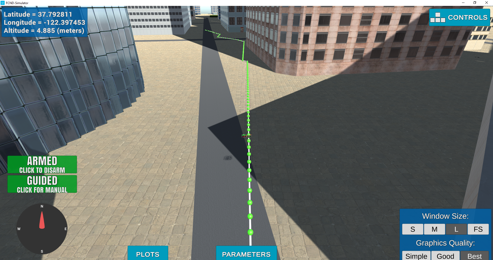
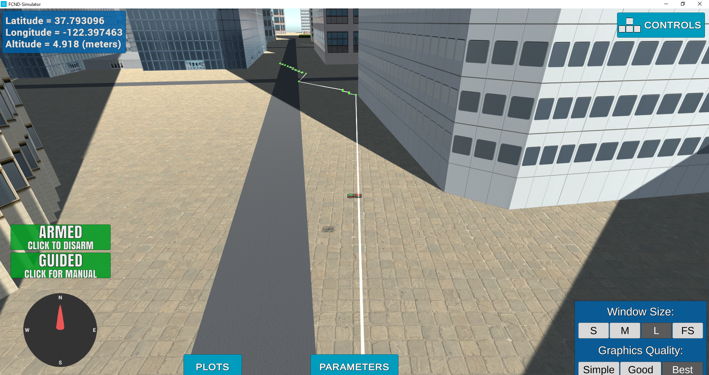

## Project: 3D Motion Planning

---

# Required Steps for a Passing Submission:
1. Load the 2.5D map in the colliders.csv file describing the environment.
2. Discretize the environment into a grid or graph representation.
3. Define the start and goal locations.
4. Perform a search using A* or other search algorithm.
5. Use a collinearity test or ray tracing method (like Bresenham) to remove unnecessary waypoints.
6. Return waypoints in local ECEF coordinates (format for `self.all_waypoints` is [N, E, altitude, heading], where the drone’s start location corresponds to [0, 0, 0, 0].
7. Write it up.
8. Congratulations!  Your Done!

## [Rubric](https://review.udacity.com/#!/rubrics/1534/view) Points
### Here I will consider the rubric points individually and describe how I addressed each point in my implementation.  

---
### Writeup / README

#### 1. Provide a Writeup / README that includes all the rubric points and how you addressed each one.  You can submit your writeup as markdown or pdf.  

You're reading it! Below I describe how I addressed each rubric point and where in my code each point is handled.

### Explain the Starter Code

The motion_planning.py script contains the MotionPlanning class which implements callbacks for position, velocity, and state. Inside these callbacks the class handles the transition between different states. These callbacks also call path_plan() which is a function that reads a file to create a grid containing obstacles. It uses the A* search algorithm to plan a path from the start to end goal through the grid. In comparison the backyard_flyer_solution.py script contains the same callbacks as motion_planning.py but it just creates a box path to fly with no consideration for obstacles.
The planning_utils.py script contains helper functions which are used in the motion_planning.py script. It contains functions to create a grid, check if actions are valid and the A* search algorithm.

### Implementing Your Path Planning Algorithm

#### 1. Set your global home position
To start the path planning from anywhere in the world the home position needs to be set from any given location. I have used the csv reader function to read the csv file and then extract the first line which contains the lat0 and lon0 values. Once the value are obtained I used self.set_home_position() with the extracted values to set the home position.

#### 2. Set your current local position
I have used the global_to_local fucntion by passing in the global position and global home values which uses that information to produce the local coordinates. I have achieved this in one line on line #136 in motion_planning.py.

#### 3. Set grid start position from local position
The original code hard coded the start position as the map centre, I have changed this to use the current local position by using the local_pos values.

#### 4. Set grid goal position from geodetic coords
I added the ability to enter parameters for goal_lat, goal_lon and goal_alt. This enables the user to choose and coordiantes they want when running the script. These values are stored in input_goal variable which is then converted into local coordinates and the grid_goal variable is then updated.

#### 5. Modify A* to include diagonal motion (or replace A* altogether)
I have added the diagonal directions (NE, SE, SW, NW) to the action Enum. The actions also contain how the action moves, they move a value in each direction as opposed to the original actions which only move one value in one direction. The cost of these actions is the sqrt of 2 as opposed to one for the original actions. Then in the valid_actions function I have added more if statements that will detect if one of the new diagonal actions needs to be applied.

#### 6. Cull waypoints 
The path returned by the A* search contains many small steps to reach the goal. I implemented a collinearity test to cull some points from the path so the drone can reach the goal in a more efficient manner. The collinearity test will loop through the points in the path and if it detects that 3 points are in a line it will delete the middle point to make the path straighter. This has mixed results, sometimes it makes a nice direct path, and other times it still has some parts of the path that are close together zig zag points.

Below are two images showing the use of culling the waypoints and without the culling.

No Culling

With Culling

### Execute the flight
#### 1. Does it work?
It works!

